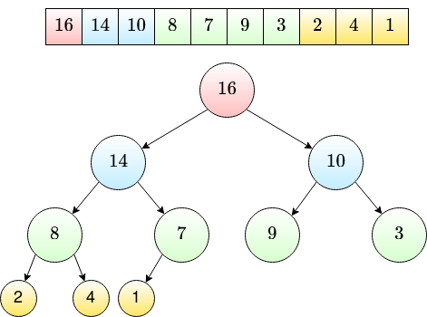
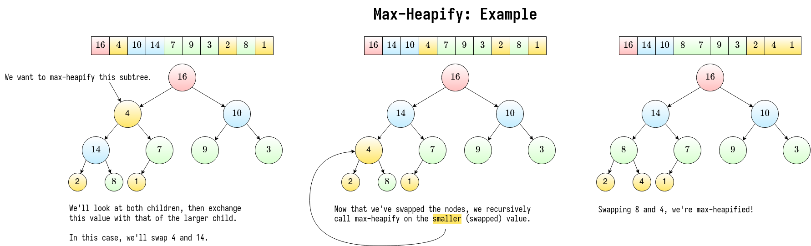

# Heaps & Priority Queue

To introduce a heap, we'll use priority queues as a motivating factor.

## Priority Queue

Operations:
- \\(insert(S, x)\\): insert element \\(x\\) into set \\(\mathbf{S}\\)
- \\(max(\mathbf{S})\\): return element of \\(\mathbf{S}\\) with the largest key
- \\(extract\\_max(\mathbf{S})\\): same as \\(max\\), but remove the element from \\(\mathbf{S}\\).
- \\(increase\\_key(\mathbf{S}, x, k)\\): increase the value of \\(x\\)'s key to new value \\(k\\).

## Heap

> **Heap**
> 
> An array visualized as a nearly complete binary tree.

### Heap as a Tree

- root of tree: first element (\\(i = 1\\))
- parent: \\(\frac{i}{2}\\)
- \\(left(i) = 2i\\)
- \\(right(i) = 2i + 1\\)

> **Max-Heap Property**
> 
> The key of a node is greater than or equal to the keys of its children.

A heap that maintains the max-heap property would be excellent fpr the priority queue's \\(extract\\_max\\) operation. Think - with a priority queue, you're constantly pulling the element with the max priority.

So the question: how do we build a max heap? It should have the following operations:

- \\(build\\_max\\_heap\\): produces a max heap from an unordered array
- \\(max\\_heapify\\): correct a *single* violation of the heap property in a subtree's root

### Max Heapify

> **Observations**:
> 
> 1. \\(max\\_heapify\\) takes \\(O(1)\\) for nodes that are a single level above leaves. *In general*, \\(O(l)\\) time for nodes that are \\(l\\) levels above leaves.
> 
> 2. \\(\frac{n}{4}\\) nodes with level 1, \\(\frac{n}{8}\\) with level 2, ..., \\(1\\) node at level \\(\log{n}\\).

So the total amount of work in \\(max\\_heapify\\)'s for loop is
\\[\frac{n}{4}(1c) + \frac{n}{8}(2c) + \dots + 1(\log{(n)}c)\\]

To make this easier to reason about, we'll set \\(\frac{n}{4} = 2^k\\).
\\[
    c2^k\left(\frac{1}{2^0} + \dots + \frac{k+1}{2^k}\right)
\\]

..which is \\(c2^k\\) multiplied by some big series that converges on some constant (less than 3).

### Heap Sort

Once we have \\(build\\_max\\_heap\\), we get \\\(heap\\_sort\\) for free!

1. \\(build\\_max\\_heap\\) from unordered array
2. find max element \\(A[1]\\)
3. swap elements \\(A[n]\\) with \\(A[1]\\)
4. discard node \\(n\\) from heap, decrementing \\(heap\\_size\\)
5. new root may violate max heap property, but its *children* are max heaps.
    - just run \\(max\\_heapify\\) on the children!