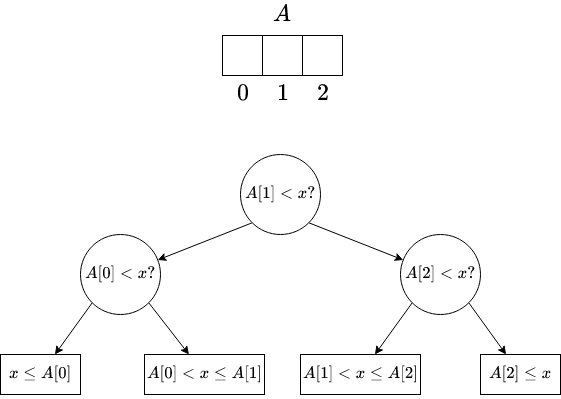
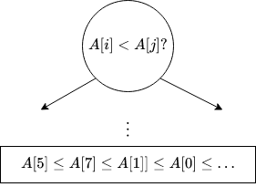
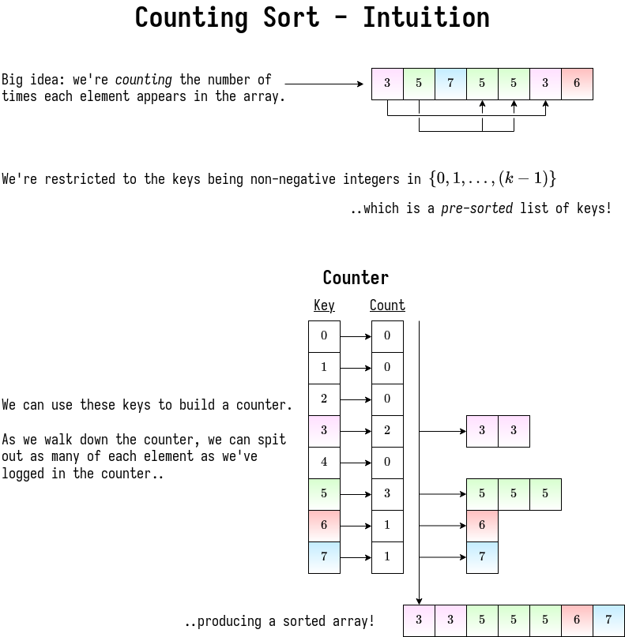

# Lower Bounds for Sorting

> **Decision Tree**
> 
> Any comparison algorithm can be viewed as as a tree of all possible comparisons, their outcomes, and resulting answer for any particular \\(n\\).

## Searching Lower Bound

Let's consider *searching* first, using binary search as an example.

<center>


</center>

|   decision tree    |           algorithm           |
| :----------------: | :---------------------------: |
|   internal node    | binary decision (comparisons) |
|        leaf        |         found answer          |
|    root-to-leaf    |      algorithm execution      |
|    path length     |         running time          |
| height of the root |    worst-case running time    |

> **Searching Lower Bound**
> 
> - \\(n\\) pre-processed items
> - finding a given item among them in comparison model requires \\(\Omega(\log{n})\\) time in worst case.
> 
> **Proof:**
> - decision tree is binary and must have at least \\(n\\) leaves, one for each answer
> - \\(\text{height} \geq \log{n} \quad \blacksquare\\)

This proves that binary search is *optimal* for the comparison model!

## Sorting Lower Bound

This problem has the same fundamental structure! You're just comparing elements of the list against *each other* rather than one search subject.

<center>


</center>

- decision tree is binary
- number of leaves \\(\geq\\) number of possible answers \\(= n!\\)
- \\(\text{height} \geq \log{(n!)}\\)

Where'd the factorial come from? (*hint: permutations*)

> **Note**: the lecturer proves that this is \\(\Omega(n \log{n})\\), but his method is heavier than we've used.
> 
> I should probably update this with our proof if we cover one.

# Linear-Time (Integer) Sorting

Assumptions:
- the \\(n\\) keys being sorted are integers \\(\in \\{0, 1, \dots, k-1\\}\\)
- each key fits in a [word](https://en.wikipedia.org/wiki/Word_(computer_architecture))
- we can do a whole lot more than raw comparisons!
- for \\(k\\) ........ (not too big) ........ can sort in \\(O(n)\\) time
  - specifically, \\(k = n^{O(n)}\\) - \\(k\\) can be *polynomial* in \\(n\\)
    - if all your integers are \\(0 \leq i \leq n^{100}\\) (for example), can sort in \\(n\log{n}\\) time.
  - as of 2011, this is still being solved!
  - the best algorithm at the time (2011) was \\(O\\left(n\sqrt{\log{\log{n}}}\\right)\\)

## Counting Sort



Problem! What if we want to differentiate between items of the same key?

```python
# L = array of `k` empty lists      # O(k) |
for j in range(n):                  #      |- O(n)
    L[key(A[j])].append(A[j])       # O(1) |

output = []

for i in range(k):                  #               | - O(n + k)
    output.extend(L[i])             # O(len(L[i]))  |
```

This is a good warmup, but not *quite* what we want. A much cooler algorithm is ***radix sort!***

## Radix Sort

Idea: imagine each integer as base \\(b\\), so the number of digits \\(= d = \log_b{k}\\).

> **Algorithm**
> 
> - Sort the integers by the *least* significant digit (counting sort)
> - ... (sort by digit in increasing order of significance)
> - Sort the integers by the *most* significant digit (counting sort)

How long does this take?
- If counting sort is normally \\(O(n + k)\\), here it's \\(O(n + b)\\).
- The `key` function is constant time: one divide, one mod for two constant operations
- So the total time is just that of counting sort multiplied by \\(d\\) digits!
\\[
    O\\left((n+b) * d\\right)\\\\
    = O\\left((n+b)\log_b{k}\\right)
\\]

  - We want \\(b\\) to be large, but not *so* large to be bigger than \\(n\\)..
    - Just set it to \\(n\\) :)
    - whenever you have a sum of things you want to minimize, usually it's when they're equal
  - This will be minimized when \\(b = \Theta(n) = O(n \log_n{k})\\)

- So if \\(k \leq n^c\\), then radix sort is \\(O(nc)\\).
  - Linear time sorting algorithm!
  - Textbook has an example of how this works, can be proven through simple induction.